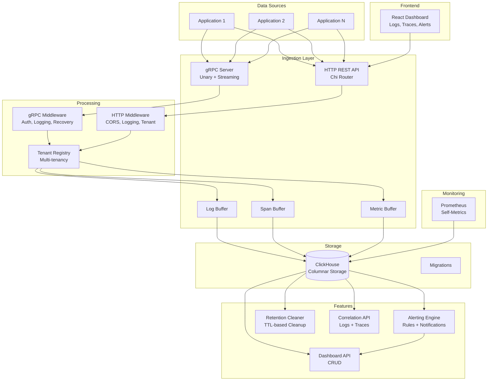

<p align="center">
  <h1 align="center">Observability Platform</h1>
  <p align="center">A full-stack observability platform for logs, traces, and metrics with gRPC ingestion, ClickHouse storage, alerting, and a React dashboard</p>
</p>

<p align="center">
  
  
  
  
  
  
</p>

---

## Overview

A multi-tenant observability platform that ingests, stores, and queries logs, distributed traces, and metrics. Features dual ingestion via gRPC (streaming + unary) and HTTP REST, ClickHouse columnar storage for high-throughput analytics, configurable alerting with webhook/Slack notifications, automatic data retention, Prometheus self-monitoring, and a React-based dashboard for visualization.

## Architecture



## Features

### Ingestion
- **gRPC** -- unary and bidirectional streaming for logs, spans, and metrics
- **HTTP REST** -- JSON-based ingestion endpoints
- **Batch Buffering** -- configurable batch size and flush intervals for high throughput
- **Multi-tenancy** -- tenant isolation via `X-Tenant-ID` header

### Storage
- **ClickHouse** -- columnar storage optimized for time-series analytics
- **Auto-migration** -- schema migrations on startup
- **Retention Policies** -- configurable TTL per signal type (logs: 30d, traces: 7d, metrics: 90d)

### Query & Analysis
- **Log Search** -- full-text search with level, service, time range filters
- **Log Aggregation** -- bucketed aggregation queries
- **Trace Queries** -- search by service, operation, duration, status
- **Trace Detail** -- full span tree for a trace ID
- **Correlation** -- cross-reference logs and traces by trace ID

### Alerting
- **Rule Engine** -- configurable alert rules with threshold conditions
- **Notification Channels** -- webhook and Slack support
- **Alert Lifecycle** -- firing, resolved states with timestamps

### Dashboard
- **React Frontend** -- pages for Logs, Traces, Dashboards, and Alerts
- **Custom Dashboards** -- CRUD API for dashboard panels with grid layout
- **Real-time** -- auto-refresh and filtering

### Observability
- **Prometheus Metrics** -- self-instrumentation exposed on `/metrics`
- **Structured Logging** -- JSON log output via `slog`
- **Graceful Shutdown** -- buffer flush and connection cleanup on SIGINT/SIGTERM

## Tech Stack

| Component | Technology |
|-----------|-----------|
| Language | Go 1.22 |
| HTTP Framework | chi v5 |
| RPC | gRPC + Protobuf |
| Storage | ClickHouse 24.1 |
| Monitoring | Prometheus |
| Frontend | React |
| Containerization | Docker Compose |

## Project Structure

```
observability-platform/
├── cmd/server/main.go           # Server entry point
├── config.yaml                  # Configuration file
├── Makefile                     # Build, test, docker commands
├── Dockerfile
├── docker-compose.yml           # ClickHouse + Prometheus + App + Dashboard
├── go.mod / go.sum
├── proto/
│   ├── observability.proto      # gRPC service definitions
│   └── gen/                     # Generated Go code
├── migrations/
│   └── 001_init.sql             # ClickHouse schema
├── deployments/
│   └── prometheus.yml           # Prometheus scrape config
├── internal/
│   ├── config/                  # YAML config loading
│   ├── api/
│   │   ├── router.go            # HTTP routes (/api/v1/...)
│   │   ├── handlers.go          # Log, trace, metric handlers
│   │   ├── dashboard.go         # Dashboard CRUD
│   │   └── alerts.go            # Alert rule management
│   ├── grpcserver/
│   │   ├── server.go            # gRPC server setup
│   │   ├── log_service.go       # Log ingestion service
│   │   ├── trace_service.go     # Trace ingestion service
│   │   └── metrics_service.go   # Metrics push service
│   ├── ingestion/
│   │   └── buffer.go            # Batch buffer (log, span, metric)
│   ├── storage/
│   │   ├── clickhouse.go        # ClickHouse client & queries
│   │   └── models.go            # Domain models
│   ├── alerting/
│   │   └── engine.go            # Alert evaluation & notification
│   ├── retention/
│   │   └── cleaner.go           # TTL-based data cleanup
│   ├── tenant/
│   │   └── tenant.go            # Tenant registry & isolation
│   ├── middleware/
│   │   ├── grpc.go              # gRPC interceptors
│   │   └── http.go              # HTTP middleware (CORS, logging, tenant)
│   └── metrics/
│       └── prometheus.go        # Prometheus metric definitions
└── web/dashboard/
    └── src/
        ├── App.js               # React app with routing
        ├── pages/               # LogsPage, TracesPage, DashboardsPage, AlertsPage
        ├── hooks/useApi.js      # API client hook
        └── utils/api.js         # HTTP client
```

## Getting Started

### Prerequisites

- Go 1.22+
- Docker & Docker Compose

### Quick Start (Docker)

```bash
# Start all services (ClickHouse, Prometheus, platform, dashboard)
make docker-up

# View logs
make docker-logs
```

| Service | URL |
|---------|-----|
| HTTP API | http://localhost:8080 |
| gRPC | localhost:9090 |
| Dashboard | http://localhost:3000 |
| Prometheus | http://localhost:9091 |
| ClickHouse HTTP | http://localhost:8123 |

### Local Development

```bash
# Build
make build

# Run with config
make run

# Run tests
make test

# Generate protobuf code
make proto
```

## API Reference

### Ingestion

| Method | Endpoint | Description |
|--------|----------|-------------|
| `POST` | `/api/v1/logs` | Ingest log entries |
| `POST` | `/api/v1/traces` | Ingest trace spans |
| `POST` | `/api/v1/metrics` | Push metric samples |

### Queries

| Method | Endpoint | Description |
|--------|----------|-------------|
| `GET` | `/api/v1/logs` | Search logs (query, level, service, time range) |
| `GET` | `/api/v1/logs/aggregate` | Aggregated log analytics |
| `GET` | `/api/v1/traces` | Search traces (service, operation, duration) |
| `GET` | `/api/v1/traces/{traceID}` | Get full trace span tree |
| `GET` | `/api/v1/correlate/{traceID}` | Correlate logs + traces |

### Dashboards

| Method | Endpoint | Description |
|--------|----------|-------------|
| `POST` | `/api/v1/dashboards` | Create dashboard |
| `GET` | `/api/v1/dashboards` | List dashboards |
| `GET` | `/api/v1/dashboards/{id}` | Get dashboard |
| `PUT` | `/api/v1/dashboards/{id}` | Update dashboard |
| `DELETE` | `/api/v1/dashboards/{id}` | Delete dashboard |

### Alerts

| Method | Endpoint | Description |
|--------|----------|-------------|
| `POST` | `/api/v1/alerts/rules` | Create alert rule |
| `GET` | `/api/v1/alerts/rules` | List alert rules |
| `DELETE` | `/api/v1/alerts/rules/{id}` | Delete alert rule |
| `GET` | `/api/v1/alerts` | List fired alerts |

### gRPC Services

| Service | Methods |
|---------|---------|
| `LogIngestionService` | `IngestLogs`, `StreamLogs`, `TailLogs` |
| `TraceIngestionService` | `IngestSpans`, `StreamSpans` |
| `MetricsIngestionService` | `PushMetrics`, `StreamMetrics` |

### Health & Metrics

| Method | Endpoint | Description |
|--------|----------|-------------|
| `GET` | `/health` | Health check |
| `GET` | `/metrics` | Prometheus metrics |

## Configuration

```yaml
server:
  http_addr: ":8080"
  grpc_addr: ":9090"

clickhouse:
  addrs: ["clickhouse:9000"]
  database: "observability"

alerting:
  evaluation_interval: 30s
  channels:
    - name: default-webhook
      type: webhook
      config:
        url: "http://localhost:9095/webhook"

retention:
  logs_ttl: 720h       # 30 days
  traces_ttl: 168h     # 7 days
  metrics_ttl: 2160h   # 90 days

tenancy:
  enabled: false
  header_name: "X-Tenant-ID"
```

## Testing

```bash
make test              # Run all tests with race detection
make test-coverage     # Generate coverage report
make lint              # Run golangci-lint
```

## License

This project is available as open source for educational and portfolio purposes.
